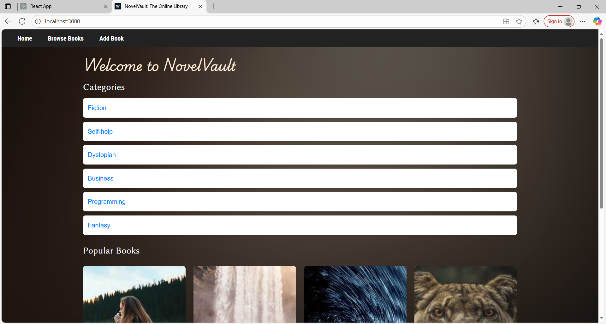
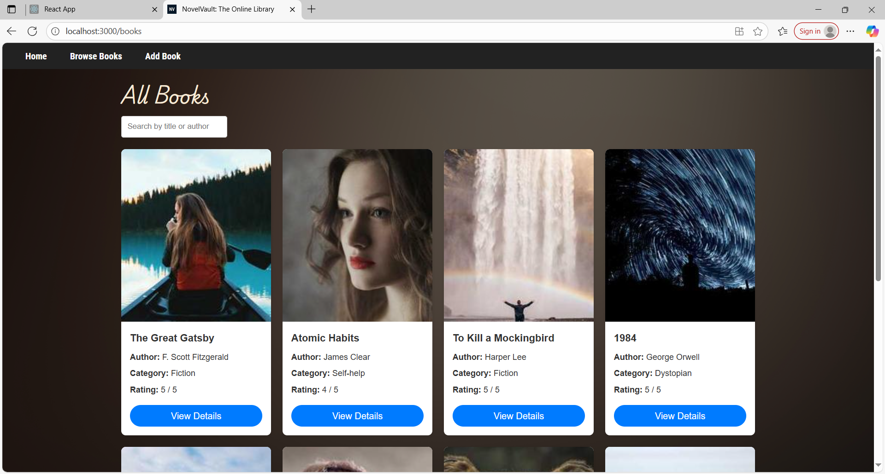
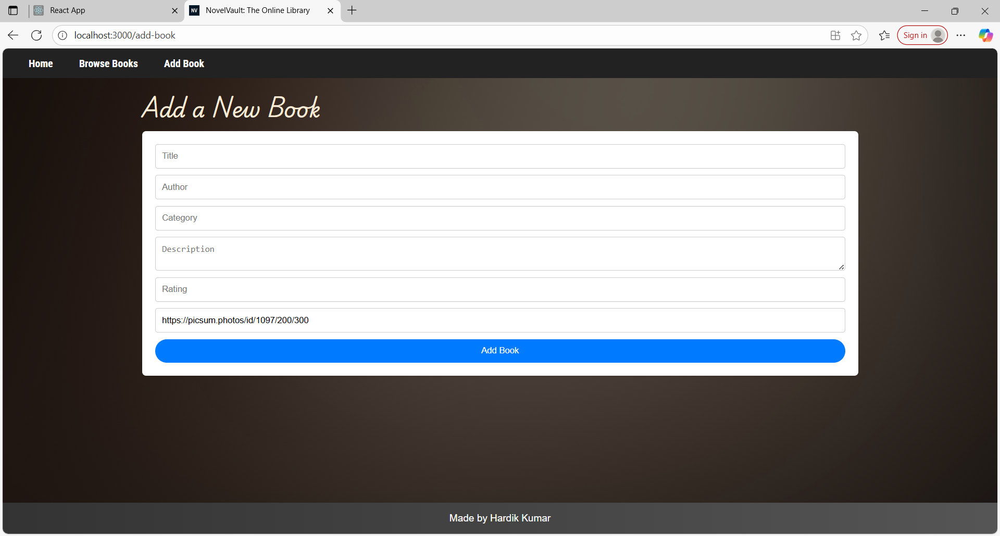

# NovelVault: The Online Library

A React-based online library application where users can browse books, view details, and add new books with cover images.  
Built with **Vite**, **React Router**, and **Redux Toolkit**.

Note: This is the Vite version of the project I had already built with Create React App. 
[CRA Project Repository Link](https://github.com/hardikjha/online-library)


## 🚀 Features
- **Home Page** with book categories and featured books
- **Browse Page** to view all books in a grid layout
- **Book Details Page** showing description, author, category, and rating
- **Add Book Page** with validation and random cover image generation

## 📸 Screenshots

### Home Page


### Browse Page


### Add Book Page



## Tech Stack
- **React** (Vite)
- **Redux Toolkit** for state management
- **React Router DOM** for navigation
- **CSS Flexbox/Grid** for layout
- **Picsum Photos API** for placeholder book covers


# 🚀 Installation & Setup

1. **Clone the repository**
   ```bash
   git clone https://github.com/hardikjha/online-library-vite.git
   cd novelvault
   ```

2. **Install dependencies**
   ```bash
   npm install
   ```

3. **Start the development server**
   ```bash
   npm run dev
   ```

4. **Open the app in your browser**
   Visit: **[http://localhost:5173](http://localhost:5173)**

---

**💡 Notes:**
- Make sure you have **Node.js (v16 or above)** installed.
- If you’re using a different port, adjust the URL accordingly.
- For production build:
  ```bash
  npm run build
  npm run preview
  ```

## Repository Link

[Click Here](https://github.com/hardikjha/online-library-vite)

Made By Hardik Kumar
